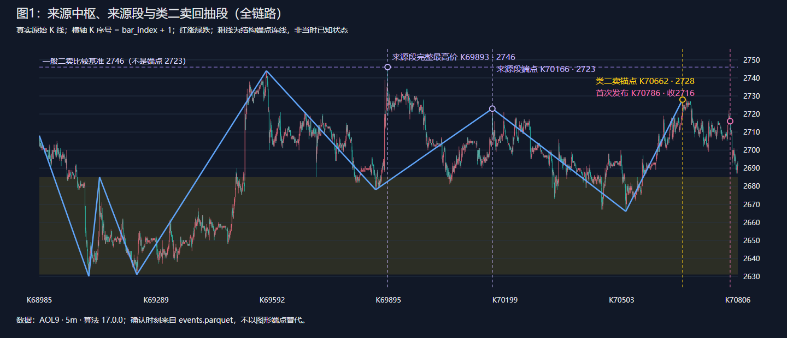
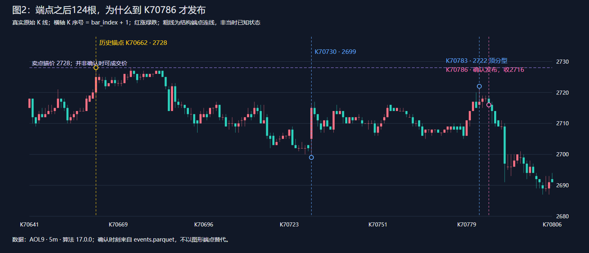
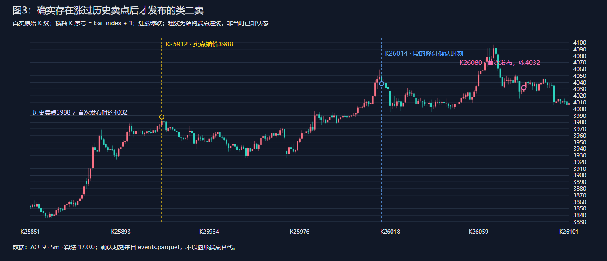

# 类二卖算法详细说明：缠论原文、K70662 的生成过程与延迟确认

核验日期：2026-09-21。范围：里程碑 15E 当前算法的说明与证据核验，不修改算法、策略、行情或已完成回测。

## 先说结论

**K70662 不是在该根 K 线收盘时就被判断为类二卖。它是卖点的历史定位位置；程序到 K70786 收盘才首次发布这个卖点，晚了 124 根。**

本例的完整理由是：

1. 某个已确认向上段相对前一个同向段的 MACD 正柱面积减小，被当前实现判定为盘整顶背驰，形成“类一卖”来源。
2. 其后完成一段向下，再完成第一段向上回抽。回抽段的结构终点是 K70662，最高价是 2728。
3. 程序比较 **2728 ≤ 来源段完整最高价 2746**，因此归为“一般类二卖”。它不是拿 2728 与截图中较近的 2719 高点比较，也不是与来源段画线终点 2723 比较。
4. 直到 K70786 新的一笔确认，线段扫描器才确认这段回抽已经结束，随后发布信号。该时刻收盘价为 2716，不能假设能够按历史高点 2728 成交。

此外，核验确实发现“发布时已经涨过历史卖点”的其他实例。它们不是程序预先知道上涨后还要卖，而是**更晚才补齐历史结构的判断证据，且信号生成层没有发布时价格失效过滤**。下文给出真实的 3988 → 4032 案例。

---

## 1. 缠论 108 课中的二卖究竟是什么

### 1.1 先确定级别，再谈二卖

原文的二卖不是“出现第二个高点”，也不是“一根阴线”“MACD 死叉”或者“跌破均线”。它涉及既定级别与次级别走势的关系。

第 53 课给出的概括是：某个高点之后，先有次级别向下走势，再有次级别向上走势；后一次向上不创新高，或者出现盘整背驰，构成第二类卖点。原文也明确讨论小级别转大级别时，不一定先出现该级别的一卖。因此，**“没有同级别标准一卖，就绝对不能有原文意义上的二卖”并不准确**。[第 53 课：三类买卖点的再分辨](https://chanlun108.cn/chanzhongshuochan108ke/53.html)

可按下面的顺序理解，图式中的“完成”必须有结构依据：

```text
前高 H → 第一次次级别下行 → 第一次次级别向上回抽结束 S
                                               ↑
                          在这里判断二卖，而不是任意后来的反弹
```

### 1.2 二卖不只有“不创新高”一种

第 101 课以二买讲解，说明卖点反向理解。它区分二三类点重合、一般情况，以及越过第一类点但出现盘整背驰的较弱情况；强调一二类点之间的紧接关系，并限定相应的过渡走势背景。二卖因此不能机械等同于“反弹高度低于前高”一个数值条件。[第 101 课：答疑 1](https://chanlun108.cn/chanzhongshuochan108ke/101.html)

对卖点作镜像理解：

| 情况 | 核心含义 |
|---|---|
| 最强 | 同时满足二卖与三卖，回抽对原中枢形成向下离开后的不回归确认 |
| 一般 | 首次向上回抽结束，未突破来源高点 |
| 最弱 | 回抽可以突破来源高点，但需要回抽自身的盘整背驰等结束依据，不能把任何创新高都称作二卖 |

这张表说明理论关系；当前代码对“结束”“来源高点”“盘整背驰”的具体替代定义见第 2 节。

### 1.3 原文中的“类”与本项目中的“类”，不能混为一谈

第 27 课确实使用了“类第一类买点”“类第二类买点”的说法，背景是盘整背驰及较大级别的历史底部分析。因此，说“原文完全没有类买卖点，全部是本项目发明的”也不准确。但不能由这些例子推出：把单一 5 分钟数据上的任意盘整背驰和两个线段相接，就完整复现了原文全部条件。[第 27 课：盘整背驰与历史性底部](https://chanlun108.cn/chanzhongshuochan108ke/27.html)

本文的“类二卖”严格指项目字段 `class_sell_2`：**来源是盘整顶背驰产生的类一卖，而不是趋势顶背驰产生的标准一卖；之后沿相同的“下行—回抽”顺序找第二点。** 对原文类买点作卖出方向的类比，与证明当前工程实现完全符合原文，是两件不同的事。

### 1.4 原文没有要求必须等本项目这么久

第 24 课把 MACD 作为背驰的辅助判断，并讨论走势尚未完全走完时的面积分析；它不等同于本项目“只用已确认线段和完整柱面积”的保守发布规则。更精细的定位还涉及次级别观察，不能用事后完整线段替代当时可知的判断。[第 24 课：MACD 对背驰的辅助判断](https://chanlun108.cn/chanzhongshuochan108ke/24.html)

本项目的 `SEGMENT` 是这套笔、段扫描器产出的工程构件。输入是 5 分钟 K 线，**不代表每一段就是原文严格递归定义的“5 分钟级别走势”**，更不能把它自动等同于原文示例中的 1 分钟次级别走势。

以上链接为课程原文的公开转载页面，并非作者原始博客；理论部分依据课程正文，而非转载站自己的交易建议。

---

## 2. 当前程序如何从 K 线走到类二卖

### 2.1 数据流与职责

```text
原始 K 线逐根到达
  → 包含处理、分型、合法笔链
  → reference.py 扫描线段：候选段 / 确认段
  → SEGMENT local_center：新实体中枢及其构件关系
  → 同方向线段力度比较：盘整顶背驰
  → 类一卖来源 + 首次下行段 + 首次向上回抽段
  → 强弱分类 → 因果事件发布
  → 图表把已发布对象画在历史端点
```

只有 Python 计算上述结构。Go 传递、读取结果；Vue 画图，不重新推导买卖点。本例使用 17.0.0，已经不经过旧笔中枢或旧线段中枢构造器。

### 2.2 盘整顶背驰来源怎样产生

`chan_divergences()` 包含不同路径。本例来自“同一实体中枢内的相邻同向已确认组成段比较”，**不是一定要等中枢最终闭合后的离开段比较**。

对两个向上段 A、C：

```text
HIST(k) = 2 × [EMA12(close) − EMA26(close) − DEA9(k)]
area(up_segment) = Σ max(HIST(k), 0)
                    k 从该段 start_bar_index 到 end_bar_index，含两端

判定要求：方向相同；area(A) > 0；area(C) < area(A)。
本条盘整背驰路径不额外要求 C 创新高。
```

EMA 从全数据集起点逐根更新，不从当前屏幕左边开始预热。负柱不抵扣向上段的正柱面积；向下段采用负柱绝对值。面积比较是在已有结构关系内进行，不能仅凭 MACD 数字独立生成本例信号。

程序将该盘整顶背驰转换成 `class_sell_1` 来源。来源段的价格取 `range_high_i64`，优先于画线终点价。

### 2.3 类二卖的实际分支

下面是对现有 `chan_trade_points()` 的解释性伪代码，不是新增算法：

```text
对每个已识别背驰来源：
    若为趋势顶背驰：来源类别 = 标准一卖
    若为盘整顶背驰：来源类别 = 类一卖

    i = 来源所在的已确认线段序号
    second = 已确认线段[i + 2]
    若 second 不存在，或方向不是向上：不发布二卖

    P = second 的完整最高价
    若 second 与严格三卖时间、价格都相同：strength = strongest
    否则若 P <= 来源一卖的价格：strength = normal
    否则若 second 自身存在盘整背驰：strength = weakest
    否则：不发布

    来源是类一卖 → 生成 class_sell_2
    标记位置 = second 的结构终点
    标记价格 = P
    事件可知时刻不得早于本次实际发现时刻
```

注意：这段工程逻辑以已有一类来源遍历生成二类，不穷尽原文小转大等二卖来源；也没有在这个分支中显式判断完整“中阴状态”生命周期。这里解释的是**代码做了什么，不是替代码宣称与 108 课完全等价**。

### 2.4 三种时间必须分开

| 字段或概念 | 实际含义 | 能否直接视为交易信号产生时间 |
|---|---|---|
| `bar_index / time` | 历史图形锚点，标签画到哪里 | 不能 |
| `confirmed_at_bar_index` | 当前信号对象记录的结构确认时刻；本分支主要继承回抽段时刻 | 不一定，可能还缺后续证据 |
| 事件 `known_at_bar_index` | 本次事件真正发布、当时开始可知的时刻 | 应以此约束回放与策略消费 |
| 某对象第一次 confirmed upsert | 该对象首次作为确认信号出现 | 审计“第一次知道”的直接依据 |

不能只看最终 Parquet 行的确认字段：后续对象修订会更新字段，第一次发布必须查事件流。`_sync_objects()` 会取 `max(结构时刻, 当前处理时刻)` 作为事件时刻，避免把晚发现对象倒灌进过去。

---

## 3. 样本身份与编号口径

| 项目 | 本文核验值 |
|---|---|
| 数据集 | `SHFE.AOL9.5m`，共 71,149 根 |
| 数据 revision | `sha256:2904362e62173a418d63feaf8855a3aef4b61ce5b0027e7801785baf9d8302fe` |
| 算法 | `chan_engineering`，`17.0.0`，cache schema 6 |
| source hash | `sha256:085255f864ec515c7deef2eaf2753ed26a4a6912a09e6ae692fed0c31727bfb5` |
| cache key | `68e48bcbe2ef7c4f570fb5dd9db5fb9d7a24dc4cfab29d7c987d8f4c8f461e57` |
| 价格口径 | `price_scale=1`、`tick_size_i64=1`，文中整数即显示报价 |
| K 编号 | **本文 K 序号 = 内部 `bar_index + 1`** |
| 时间 | 使用 UTC+08 自然时间；底层时间戳表示 K 线结束时刻 |

K70662 对应内部索引 **70661**：2026-08-21 **23:05–23:10**，开 2720、高 2728、低 2718、收 2725。它的 `trading_day` 是 2026-08-24，不等于自然日期；不能用交易日直接替代图表时间。

本文按当前 17.0.0 解释。旧的 16.0.0 缓存中也有同 ID、同锚点、同 124 根延迟的一般类二卖，但来源背驰 ID 与中枢序号不同。**仅凭截图不能确定算法版本，不应把旧缓存的来源中枢和当前缓存拼成一条证据链。**

---

## 4. K70662 的类二卖：逐步走完这条对象链

### 第一步：先找真正被算法引用的中枢

来源是 SEGMENT 实体中枢：

`local-center-85ed38c1c61efaa90f1b`

它的三个种子段如下，表中都是屏幕式 K 序号：

| 种子 | 结构方向及端点 | 完整区间 |
|---|---|---|
| 1 | K68985 的 2708 → K69114 的 2630，向下 | [2630, 2708] |
| 2 | K69114 的 2630 → K69142 的 2685，向上 | [2630, 2685] |
| 3 | K69142 的 2685 → K69239 的 2631，向下 | [2631, 2685] |

因此冻结核心为：

```text
ZD = max(2630, 2630, 2631) = 2631
ZG = min(2708, 2685, 2685) = 2685
```

种子时间跨度为 2026-07-28 22:55 至 2026-07-31 14:50。它首次作为 ACTIVE 对象发布于内部 69337（K69338），后在内部 69345 修订。不能把种子结束的 K69239 当作当时已经确认了整个中枢。

到本例信号发布时，它处于 `PENDING_BREAK`，还没有分界闭合确认。这不阻止活动中枢内部的盘整背驰路径工作。

**截图附近约 2707–2719 的蓝框，不是这条来源链的 [2631,2685] 中枢核心。** 当前界面的实体中枢默认优先显示 BI 流，而买卖点使用 SEGMENT 流；黄色“分界确认”也可能属于 BI 流。不能根据离标签最近的框、黄竖线，就认定它是卖点的来源或卖点的确认时刻。

### 第二步：两段向上走势力度收缩，产生盘整顶背驰来源

为方便阅读，将相关段命名为 A、B、C、D、E；这只是本文编号，不改变原对象。

| 段 | 结构端点 | 完整最高价 | 作用 |
|---|---|---:|---|
| A | K69239，2631 → K69577，2744 | 2744 | 前一个同向向上段 |
| B | K69577，2744 → K69862，2678 | 2746 | 中间向下段 |
| C | K69862，2678 → K70166，2723 | **2746** | 被比较的向上段，形成类一来源 |
| D | K70166，2723 → K70514，2666 | 2723 | 类一之后第一次向下段 |
| E | K70514，2666 → **K70662，2728** | **2728** | 第一次向上回抽，即本例类二位置 |



[打开可放大的矢量原图](assets/class-second-sell-70662/overview.svg)。

图 1 的浅黄色区域仅投影固定核心价带 [2631,2685]，不表示该中枢从图左起就已被确认；粗蓝线为最终结构端点连线，不是可提前获取的预测线。更细的原始 K 线保留全部数据，没有重采样。

MACD 面积核验结果：

```text
area(A) = 251.52175553492492
area(C) = 214.98688516785765
area(C) / area(A) ≈ 0.8547
力度面积减少约 14.53%
```

二者属于同一中枢关系中的相邻同向确认段，且后者面积缩小，因此产生盘整顶背驰：

`divergence-5420ed116fba0a5c556b`

它首次发布于内部 **70229（K70230）**，事件序号 `369343`。后来因结构归属/确认信息修订，在内部 70686、70694 又更新两次；最终行写的 70694 **不是它第一次出现的时间**。

### 第三步：解释最容易看错的 2746、2723 与 2719

程序同时保存两种价格：

- **画线端点价**：用于描述结构端点，C 段结束在 K70166，价 2723。
- **完整范围最高价**：由组成笔区间合并得到，C 段为 2746，真实高价来自 **K69893，2026-08-11 21:05**，并不在 C 的画线终点。

`_high(C)` 优先读取第二种价格。所以来源“类一卖价格”是 **2746**，虽然来源时间锚点在 K70166。

这是本实现一个重要的展示/语义差别：**信号的时间锚点和区间极值来源可以不是同一根 K 线；不能说 K70166 这根实际最高价是 2746，它的最高价只有 2723。** 这里如实披露代码行为，不把这种组合自动认定为原文最精确的买卖点定位。

截图中较近的高点 **K70612、2719** 则是 E 段内部的一笔端点。它不是该类二卖引用的类一来源。看见 2728 高于 2719，不能直接推出“程序不创新高条件算错了”；程序比较的是另一条已明确引用的结构。

### 第四步：类一之后的首次下行与首次回抽

从 C 的结构终点出发：

```text
C 结束：K70166，2723
    ↓ D：首次向下
K70514，2666
    ↑ E：首次向上回抽
K70662，2728
```

D 首次确认于内部 70686（K70687），之后在内部 70694 修订。同一个 70686 时刻，E 才作为候选向上段发布。**在 K70662 当下，不仅 E 还没有确认完成，就连其前面的 D 也尚未以这个最终结构被确认。**

E 的对象 ID：`segment-1852d5472c96aafd3a16`。

### 第五步：为什么到 K70786 才确认 E 已经结束

程序不是跌一根 K 线就宣布 E 结束，也不是检测 K70786 当根跌破某条均线。它等待后续已确认笔进入 `reference.py` 的线段扫描器，满足反向结构条件。



[打开可放大的矢量原图](assets/class-second-sell-70662/confirmation.svg)。

以下六笔是这次确认过程里的关键输入。笔序号是扫描器的内部数组序号，**不是 K 线编号**：

| 内部笔序号 | 方向、起止 K 与价格 | 该版本笔确认的 K 序号 |
|---:|---|---:|
| 3081 | 下：K70662 2728 → K70694 2707 | K70695 |
| 3082 | 上：K70694 2707 → K70700 2717 | K70701 |
| 3083 | 下：K70700 2717 → K70706 2707 | K70708 |
| 3084 | 上：K70706 2707 → K70712 2717 | K70714 |
| 3085 | 下：K70712 2717 → K70730 2699 | K70731 |
| 3086 | 上：K70730 2699 → K70783 2722 | **K70786** |

E 的扫描器起点笔序号为 3078，终点笔序号为 3081。向上段确认函数 `_confirm_up_segment()` 的本次数值路径如下：

1. 输入笔 3082 时，`3082 − 3081 = 1 < 3`，后续结构长度不足，返回 `-1`，未确认。
2. 输入笔 3083 时是下笔起点。原始 K 线高点 2717 没有超过旧端点 2728，不改端点，也不确认。
3. 输入笔 3084 时，已可以比较后续低点，但 K70706 的低点 **2707 ≥ K70694 的低点 2707**，没有出现要求的更低低点，仍返回 `-1`。
4. 输入笔 3085 时，原始起点高点仍是 2717，仍不改旧高点、不确认。
5. 到 K70786，K70783 的顶分型被确认，发布笔 3086（2699 → 2722）。扫描器重新比较：先接受 2707 ≥ 2707；再发现 **K70730 的低点 2699 < 2707**，反向破坏路径成立。
6. 本次额外分支比较为 `2707 > 2719`，结果为假，因此返回 **0**，走“直接确认并反向”分支，而不是进入临时段继续等待。`2719` 来自 E 内部用于扫描比较的高点，不是二卖分类的 2746 基准。
7. `_update_segment()` 把 E 置为 `confirmed=true`，其结构终点仍留在 K70662，确认时刻记录为内部 70785，也就是 **K70786**。

所以本例不是“必须等后面的整段下跌全部结束”：K70786 时，随后向下段仍为候选。**真正触发的是后续一笔的确认，使先前向上段通过反向结构检查。**

复核方法不是用全历史最终笔链硬套过去：附带脚本先分别重建 `known_at ≤ 70784` 和 `known_at ≤ 70785` 的笔事件状态，再调用生产扫描器。前一个前缀中 E 未确认；后一个前缀中 E 已确认，函数返回值确实由 `-1` 变为 `0`。

### 第六步：执行类二卖价格分类并发布

E 成为已确认段之后，`chan_trade_points()` 才能在来源 C 后取到 `i+2` 的回抽段。

```text
来源类别：盘整顶背驰 → class_like
回抽段：E，向上，已确认
回抽最高：2728
来源类一价格：2746
2728 <= 2746：成立
同点严格三卖：未命中

输出：class_sell_2
强弱：normal
规则：second_point_normal
图形定位：bar_index=70661，price_i64=2728
首次可知：known_at_bar_index=70785
```

目标对象为 `trade-point-5ce8c56bd7e8e6f9d5a8`。它在事件流里只有一次发布，事件序号 **372046**、revision 1；同根稍早的 **372041** 是 E 段确认事件。没有在 K70662 提前发布过这个类二卖。

当前版本同一锚点还存在另一条“类一卖”来源链，其依据是 C→E 的盘整背驰。这不等于本例要靠 E 自己的背驰才能成立：**本例命中的是 normal 分支，2728≤2746 已足够；不能把同点另一个标签的依据混进来。**

### 第七步：把端点、确认、可能成交放在同一张时间表里

| 事件 | 屏幕式 K 序号 | UTC+08 时间 | 含义 |
|---|---:|---|---|
| 历史卖点锚点 | K70662 | 2026-08-21 23:10 收盘 | 2728 是这一根最高价，不是当时已知卖点 |
| 本类二卖首次发布 | K70786 | 2026-08-25 09:45 收盘 | 收盘 2716，已距锚点 124 根 |
| 默认下一根成交的最早候选 K | K70787 | 2026-08-25 09:45–09:50 | 开盘 2716；还要看策略是否消费、风控和撮合条件 |

124 根是实际数据条数差，不是 124 个连续自然时间的五分钟。期间跨夜盘、周末和休市；不可简单推算成连续墙钟时间。

本例发布价低于锚价 12 点，所以它不是“发布时已超过 2728”的例子。但价格此前到过 2699，再回升到 2722 后才补齐最后一笔的确认条件；**“从后面的低点已反弹一截才确认先前卖点”在本例也确实存在。**

---

## 5. 为什么另一些类二卖，确认时已经涨过卖点很多

### 5.1 当前逻辑确认的是历史结构，不是当前价格重新满足卖出条件

这里有三层延迟：

1. 笔要等分型及笔链确认，线段又要等后续笔的反向结构确认。
2. 背驰的中枢归属、离开后的跟随段等证据可能比该段自身更晚确认。
3. 每次结构更新会重新生成依赖它的历史买卖点，所以某个较老端点可以在此时首次满足完整条件。

当前二类点生成分支没有以下过滤：发布时现价是否已经高于卖点；从锚点起是否超过限定根数；来源高点是否被后续行情重新突破。`follow_through_status=pending` 也不是这些检查已通过的意思，更不是保证未来会跌。

因此“被标为已确认”只说明**当前程序的历史结构条件已满足**，不等于“现在还有合适的卖出价”。策略层可能另有信号年龄、仓位和风险条件，但不能用这些下游过滤替代对指标标签自身语义的解释。

### 5.2 真实反例：历史卖点 3988，首次发布时已收 4032

对象：`trade-point-df023076ec4c9a354201`。



[打开可放大的矢量原图](assets/class-second-sell-70662/late-rise.svg)。

| 证据 | 结果 |
|---|---|
| 历史锚点 | 内部 25911，即 **K25912**，卖点价 **3988** |
| 来源类一卖价格 | **3887** |
| 回抽段 | `segment-1b577d5f5df13f84a392` |
| 一般二卖条件 | `3988 ≤ 3887` 不成立 |
| 最弱二卖补充条件 | 回抽段自身出现盘整顶背驰 |
| 该补充背驰首次发布 | 内部 **26079（K26080）**，事件 `135869` |
| 背驰面积 | **288.9667479398933 < 444.50872200215116** |
| 类二卖首次发布 | 同根，事件 **135870**，`strength=weakest` |
| 此时收盘 | **4032**，已比历史卖点 3988 高 **44**，约 **1.10%** |
| 实际首次发布延迟 | `26079 − 25911 = 168` 根 |

关键不在于 4032 这根又产生了什么新的卖出价形态，而是到这时，`divergence-dec9deb4ecc7e72060e7` 才补上回抽段的盘整背驰证据。它带有跟随段 `segment-eee7b90f15cce204c41e`，当前实现的相应路径要等这类后续结构；于是之前缺条件的最弱类二卖此时才被生成。

**尤其要警惕字段差别：**该信号的 `confirmed_at_bar_index=26013`、`confirmation_latency_bars=102`，但首次事件 `known_at_bar_index=26079`。102 只反映当时继承的段结构时刻差，不能解释成信号真的在 102 根后就可用。这里以事件流核验出的 **168 根**为准。

这不是本文修改了字段，而是发现当前字段在这种晚补证据场景中会产生歧义。要改字段语义或交易过滤，需要另行设计契约与回归测试；本次只记录事实。

### 5.3 全样本核查，不只挑一个例子

对该 17.0.0 缓存事件流，按稳定对象 ID 去重，取每个 `class_sell_2` 的**第一次 confirmed upsert**，共 **57** 个对象。其中 **5** 个的首次发布 K 线收盘价高于信号锚价：

| 卖点 K | 首次发布 K | 延迟根数 | 信号价 | 发布时收盘 | 超过信号价 | 分级 |
|---:|---:|---:|---:|---:|---:|---|
| 25912 | 26080 | 168 | 3988 | 4032 | +44 | 最弱 |
| 64086 | 64141 | 55 | 2778 | 2784 | +6 | 最强 |
| 64598 | 64827 | 229 | 2719 | 2724 | +5 | 最强 |
| 24864 | 25066 | 202 | 3661 | 3663 | +2 | 一般 |
| 40340 | 40513 | 173 | 2860 | 2861 | +1 | 一般 |

统计口径包含曾经发布的对象，不因它后来删除、修订就从历史中抹去；不是最终图表仍存活对象计数，不是交易笔数，也不是胜率。这里比较收盘价，不统计确认前区间最高价或其后涨幅。

“最强”也可能在发布时已经上涨，不矛盾：这里的强弱是历史结构分级，不是信号新鲜度和未来收益评级。

---

## 6. 这样的延迟是否违背原文精神

必须分开评价：

**就数据因果而言：**晚确认不自动等于未来函数。只有在 K70786 之后才展示并消费这个信号，即使图形定位回 K70662，也可以是合法的历史结构标记。但若把它当作 K70662 当时已经知道，并按 2728 回填成交，就使用了未来信息。本文核验的是信号事件和结构前缀，没有据此宣称所有策略回测都已通过因果审计。

**就原文操作意义而言：**不能把“过了很多根才完成的结构归档”冒充“在端点当下已经抓到了二卖”。当前单周期确认扫描器、来源分类及固定面积比较都是工程选择，可能比结合次级别判断的方式滞后，也未覆盖原文全部背景条件。延迟本身不能单独证明违背理论；但忽略延迟、把过时标签直接称为当前可操作卖点，会造成实质误导。

当前实现已能说明“这个历史标签为什么出现”，但并没有仅凭 `confirmed=true` 就证明“现在仍值得按此卖出”。对用户来说，至少应同时看到：

- 卖点定位：K70662、2728。
- 首次可知：K70786、当根收 2716。
- 实际延迟：124 根。
- 来源中枢、来源段完整高价及其真实极值 K 线。
- 属于一般/最弱/最强哪条判定；是否属于晚补证据的历史信号。

这些是后续改进建议，本次没有擅自增加止损、失效阈值、提前确认或交易过滤，也没有把原来信号提前到端点。

---

## 7. 源码入口、证据文件与复现

### 7.1 核心源码入口

| 文件 | 函数/位置 | 本文对应内容 |
|---|---|---|
| [reference.py](../python/src/tvbt/chan/reference.py) | `_confirm_up_segment`、`_update_segment`、`ReferenceSegmentAccumulator` | 候选回抽段为何在后续笔确认后才结束 |
| [engine.py](../python/src/tvbt/chan/engine.py) | `_sync_bi_path`、`_update_structures` | 已确认笔链、组成笔完整区间、只把确认段送入上层 |
| [engine.py](../python/src/tvbt/chan/engine.py) | `_local_signal_centers`、`_sync_objects`、`_signal_payload` | SEGMENT 中枢投影、实际发现时刻、信号字段 |
| [signals.py](../python/src/tvbt/chan/signals.py) | `_high`、`_macd_area`、`chan_divergences` | 高价取完整区间；同向柱面积收缩；来源背驰 |
| [signals.py](../python/src/tvbt/chan/signals.py) | `chan_trade_points` | `i+2`、三种强弱、类二卖生成 |
| [ChartGroup.vue](../web/src/components/ChartGroup.vue) | K 线序号显示 | 内部索引加 1 |
| [DECISIONS.md](../DECISIONS.md) | C-028、C-040、P-036、P-053、P-060 | 类点分类、端点/完整区间、中枢显示流、15E 迁移背景 |

### 7.2 机器可读证据

[evidence.json](assets/class-second-sell-70662/evidence.json) 保存：

- 原缓存 manifest、目标卖点、来源背驰、中枢及线段对象。
- 相关对象的完整事件修订历史与实际事件序号。
- 内部 70784/70785 两个事件前缀的生产线段扫描结果及函数调用记录。
- K70786 当根的分型、笔、段和信号发布事件。
- 57 个类二卖对象的首次发布统计与上涨案例的依赖事件。
- 关键原始 K 线及本地结束时间。

三个 SVG 都直接由标准化原始 OHLC 生成，是可放大的静态图，不是 AI 想象图，也未修改运行界面截图。

### 7.3 复现命令

在仓库根目录执行，必须使用项目固定的 Python 3.14：

```powershell
& 'D:\ProgramData\anaconda3\envs\pydev3.14\python.exe' `
  python/scripts/export_class_second_sell_evidence.py `
  --cache trading-data/cache/chan/68e48bcbe2ef7c4f570fb5dd9db5fb9d7a24dc4cfab29d7c987d8f4c8f461e57 `
  --bars trading-data/normalized/SHFE.AOL9.5m/2904362e6217/bars.parquet `
  --output docs/assets/class-second-sell-70662
```

脚本针对本文的固定样本，检查算法 source hash、版本及数据 revision 一致；调用生产 MACD 方法重新核对两段面积；使用事件前缀重建笔链调用生产线段扫描器，断言 K70785 未确认、K70786 已确认。它只重写文档导出的证据及配图，不写原始行情、缓存或 run。

正文的 PNG 是同目录 SVG 的浏览器渲染副本，便于 Markdown 阅读器显示；重新导出证据的权威配图是 SVG。

### 7.4 本次交付与限制

本次交付为 15E 文档补充：原文对照、目标对象因果追溯、延迟上涨反例、三张真实 K 线配图和可重复执行的证据导出脚本。**无 API/Schema 修改，无运行算法修改，无交易规则修改。**

已执行验证：

- 证据导出成功，两次生成的 `evidence.json` SHA-256 一致。
- 源码身份、两段 MACD 面积、确认前后笔链—线段前缀断言通过。
- `test_chan_signals.py`、`test_chan_actual_ranges.py`、`test_chan_structures.py`：**25 passed**。
- 新脚本 Ruff 检查及格式检查通过；文档本地链接、SVG XML、124 根延迟与 57/5 统计断言通过。
- 三张 SVG 已用无头浏览器渲染 PNG 并逐图检查，无缺字或标签遮挡问题。

未运行 Go/Vue 全套测试，原因是未修改这两端的运行代码或契约。新增可复用样例为本文证据 JSON、SVG/PNG 与导出脚本；原始行情样例未改动。

核验覆盖指定缓存的对象事件、两段 MACD 面积及目标确认前后的笔链—线段扫描；不是重新从第 0 根运行全部引擎的全量验收。行情取现有标准化文件，不独立核实数据供应商的历史行情真实性。原文理论与工程实现之间的差异已明确列出，不能以“能够复现代码输出”代替“已证明完整符合缠论”。
