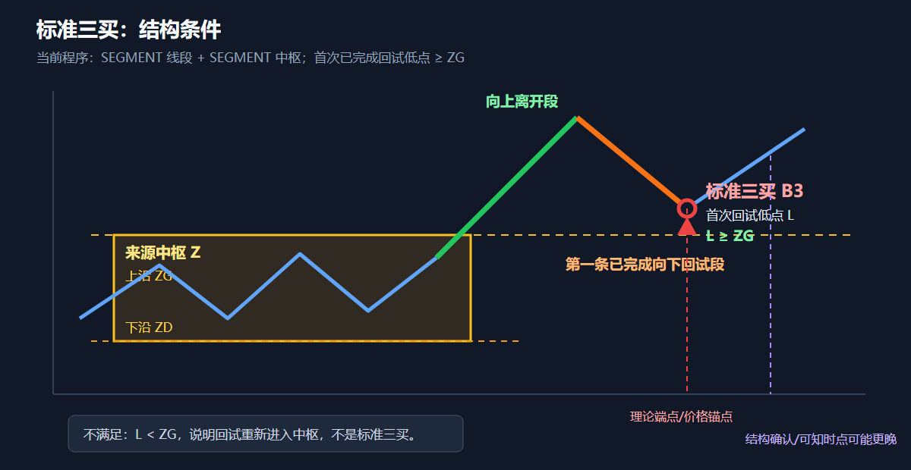
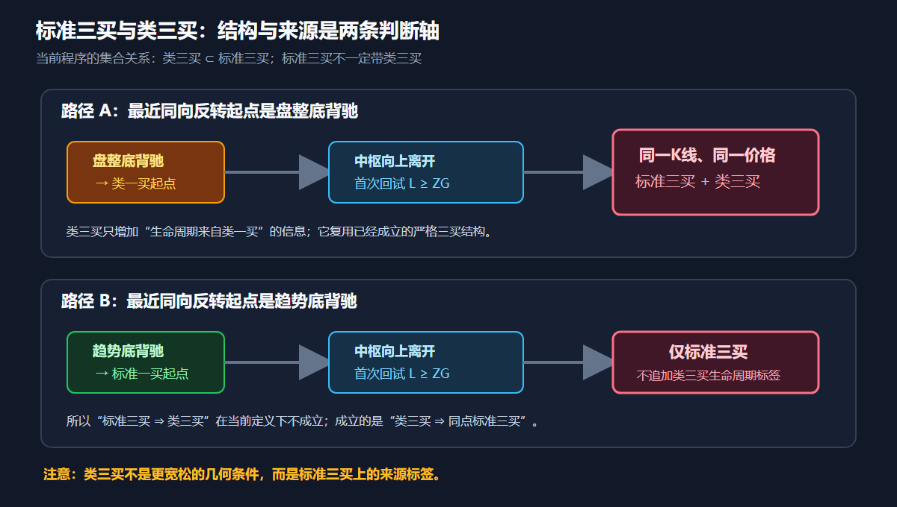

# 标准三买与类三买：定义、算法关系与图形示例

核验日期：2026-09-25。适用范围：当前 `chan_engineering@18.0.0` 单周期实现。本文解释现有语义，不修改算法、缓存或已经完成的回测。

## 先说结论

当前程序中：

1. **标准三买**是结构信号：中枢向上离开以后，紧随离开段的第一条已完成向下回试段，其最低价不低于中枢上沿 `ZG`。
2. **类三买**不是一套更宽松的三买条件。程序必须先得到标准三买；如果该三买之前最近的同方向反转起点是盘整底背驰产生的“类一买”，才在同一根 K 线、同一价格额外发布“类三买”生命周期标签。
3. 因而当前集合关系是：

   ```text
   类三买 ⊂ 标准三买

   类三买  ⇒ 同点一定有标准三买
   标准三买 ⇏ 不一定有类三买
   ```

4. 三卖完全镜像：`类三卖 ⊂ 标准三卖`。

把“类三买”理解成“条件较宽松、范围较大的三买集合”，不符合当前代码定义。当前“类”描述的是**反转生命周期来源**，不是回试边界更宽松。

---

## 1. 标准三买是什么

### 1.1 理论结构

先固定分析级别，并在该级别上得到一个中枢 `Z`。价格向上离开中枢后，第一次次级别向下回试不重新跌入中枢，形成第三类买点。

当前程序将这条规则固定为：

```text
来源中枢 Z 已经向上离开
离开段方向 = up
紧随离开段的第一条已完成回试段方向 = down
回试段完整最低价 L >= 中枢上沿 ZG
```

判断公式为：

```text
B3 = left_center
     AND leave_direction == up
     AND first_return.direction == down
     AND low(first_return) >= ZG
```

其中等于边界也成立：`L == ZG` 是“触及但没有跌破”，按当前 `lesson20_inclusive_v1` 口径确认三买。



### 1.2 当前程序使用笔还是线段

当前生产信号固定使用：

```text
已确认线段
  → unit_kind=SEGMENT 的线段中枢
  → 向上离开线段
  → 第一条已完成向下回试线段
  → 标准三买
```

笔中枢目前可以独立显示，但不参与三买计算。也就是说，核对三买时必须打开“线段”和“线段中枢”，不能拿图上的笔中枢边界解释当前三买。

权威实现位于：

- [`_third_points()`](../python/src/tvbt/chan/signals.py#L545)：扫描严格三买/三卖；
- [`chan_trade_points()`](../python/src/tvbt/chan/signals.py#L640)：组合标准点和类生命周期标签。

### 1.3 “第一次回试”的含义

程序只检查：

```text
return_index = center.exit_index + 1
```

即真正离开段后的紧邻第一条反向线段。第二次、第三次回到同一中枢上方，不会被补记成这个中枢的标准三买。

### 1.4 使用完整区间，不只看画线端点

回试价格使用回试线段的完整实际区间最低价，而不一定只是蓝色线段的端点价。线段由多笔组成时，其区间最低价可能来自内部某根 K 线。

因此核对应查看：

- `return_object_id`；
- 回试线段的 `range_low_i64`；
- `ZG`；
- `return_depth_to_core_i64 = range_low_i64 - ZG`。

不能仅凭截图上折线端点“看起来在中枢上方”就确认程序计算正确。

### 1.5 端点、确认和成交不是同一时刻

三买标记锚在回试线段的理论结束位置，但程序必须等该线段被后续结构确认后才知道它已经结束。因此至少存在三个时点：

1. 回试的价格端点；
2. `known_at_bar_index`：程序首次可以确认该对象的时点；
3. 回测成交时点：默认在信号可知后的下一根 K 线开盘。

图上的三买落在历史低点，不表示程序能在当时提前知道并成交。

---

## 2. 类三买是什么

### 2.1 当前项目的定义

类三买是标准三买上的来源标签。它表达：

> 这次严格三买之前，最近的同方向反转生命周期起点来自盘整底背驰产生的类一买，并且在三买之前没有更新的标准一买取代它。

程序步骤是：

1. 先独立扫描出全部标准三买、三卖；
2. 收集此前的标准一类点和类一类点；
3. 对每个标准三买，寻找它之前最近的同方向一类点起源；
4. 最近起源为 `class_like` 时，复制该标准三买；
5. 复制记录改成 `class_buy_3`，并把来源引用改为相应类一买的盘整背驰来源；
6. K 线、时间、价格、离开段和回试段仍与标准三买相同。

对应代码逻辑：

```python
for third in thirds:
    prior = 最近的同方向一类点起源
    if not prior or prior[-1].signal_class != "class_like":
        continue
    发布同点 class_buy_3 / class_sell_3
```

### 2.2 为什么两个标记完全重合

类三买不是重新扫描出另一条回试段，而是从已经成立的标准三买复制而来。因此两条记录天然具有：

- 相同 `bar_index`；
- 相同 `time`；
- 相同 `price_i64`；
- 相同 `departure_object_id`；
- 相同 `return_object_id`；
- 相同 `ZG/ZD` 边界关系。

主要差别是：

| 字段/语义 | 标准三买 | 类三买 |
|---|---|---|
| `signal_type` | `buy_3` | `class_buy_3` |
| `signal_class` | `standard` | `class_like` |
| 结构来源 | 严格三买对应的中枢 | 复用同一严格三买结构 |
| 生命周期来源 | 不要求类一起源 | 最近同向起点必须是类一买 |
| 是否能单独存在 | 可以 | 不可以 |



### 2.3 “类”不表示边界条件更宽松

当前程序没有以下规则：

```text
标准三买要求 L >= ZG
类三买允许 L 稍低于 ZG
```

也没有“第二次回试仍可算类三买”“只要在外围区间之上就算类三买”等放宽条件。类三买使用的仍然是已经通过 `L >= ZG` 的同一标准三买。

---

## 3. 截图中的 K38196 示例

按截图中对象树可见事实：

| 事实 | 数值 |
|---|---:|
| 计算单元 | 线段 `SEGMENT` |
| 来源线段中枢下沿 `ZD` | 2769 |
| 来源线段中枢上沿 `ZG` | 2859 |
| 三买锚点 | K38196 |
| 三买价格/回试低点 | 2875 |
| 高于核心上沿 | `2875 - 2859 = 16` |

结构判断是：

```text
价格先以向上线段离开中枢
  → 第一条已完成向下回试线段结束在 K38196
  → 回试最低价 2875
  → 2875 >= ZG 2859
  → 标准三买成立
```

同一位置又出现类三买，不是因为又执行了一套较宽松的价格判断，而是因为：

```text
K38196 标准三买成立
  + 此前三买方向最近的一类点起源为盘整底背驰类一买
  = 同点追加类三买生命周期标签
```

如果价格结构完全相同，但此前最近同向起点是趋势底背驰产生的标准一买，结果将只有“三买”，不会追加“类三买”。

截图只能支持上述可见数值。要做完整审计，还应从计算结果导出该点的 `reference_object_id`、`departure_object_id`、`return_object_id`、`known_at_bar_index` 和最近一类点来源，不能只依据图形颜色判断。

---

## 4. 三卖的镜像规则

标准三卖要求：

```text
来源中枢向下离开
离开段方向 = down
第一条已完成回抽段方向 = up
回抽段完整最高价 H <= 中枢下沿 ZD
```

只有已经成立的标准三卖，在此前最近同方向反转起点为盘整顶背驰类一卖时，才同点追加类三卖。

所以：

```text
类三卖  ⇒ 同点一定有标准三卖
标准三卖 ⇏ 不一定有类三卖
```

---

## 5. 常见误解

### 误解一：标准三买更严格，所以一定也属于类三买

这只有在“类三买”被定义为标准三买的宽松超集时才成立。当前项目没有采用这个定义；当前“类三”是来源标签，所以集合方向相反。

### 误解二：同时出现两个标记，表示执行了两次独立确认

不是。程序只执行一次严格三买结构判断，类三买复用该结果并补充生命周期来源。

### 误解三：类三买可以没有标准三买

当前不可以。若数据中出现孤立 `class_buy_3` 而没有同位置 `buy_3`，应视为结果一致性错误。

### 误解四：显示笔中枢时，三买就按笔中枢计算

当前不成立。图层显示和信号计算层不同；当前三买仍固定消费线段及线段中枢。

### 误解五：回试线段端点没有跌破 ZG 就一定成立

程序比较完整线段区间最低价。内部 K 线若已经跌破 `ZG`，即使画线端点仍在 `ZG` 上方，也不成立。

---

## 6. 数据一致性检查

当前结果应持续满足以下不变量：

```text
对每个 class_buy_3：
  必须存在同 bar_index、time、price_i64 的 buy_3

对每个 class_sell_3：
  必须存在同 bar_index、time、price_i64 的 sell_3

反向要求不成立：
  buy_3 可以没有 class_buy_3
  sell_3 可以没有 class_sell_3
```

建议对象树将当前名称进一步显示为：

- `三买（标准结构）`；
- `盘整链三买（类一起源）`；
- `三卖（标准结构）`；
- `盘整链三卖（类一起源）`。

这样比只显示“三买/类三买”更能准确表达当前程序语义。

---

## 7. 与既有说明的关系

- [缠论108课：背驰与买卖点的工程定义](14-chan-108-segment-center-divergence-trade-points.md)
- [笔中枢、线段级买卖点与108课差异](25-bi-center-and-trade-points-vs-chan108.md)
- [类二卖 K70662 的来源与延迟确认](22-class-second-sell-70662-explained.md)

本文只解释当前实现。若将来把“类三买”重新定义为条件更宽松的独立结构，必须先给出明确的中枢边界、回试序号、允许跌破深度和确认规则，并提升算法版本；不能只改变界面名称或复制信号。
