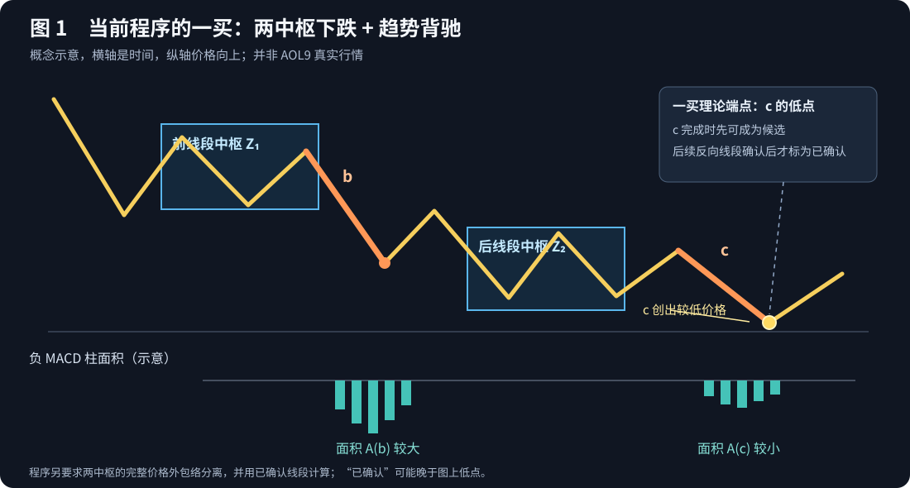
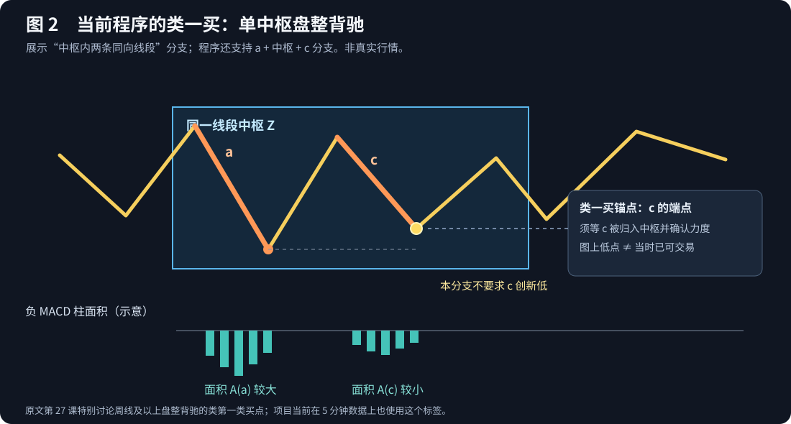

# 一买与类一买：108课原意、当前算法和图形核对

核验日期：2026-09-26。本文只解释当前 `chan_engineering@18.0.0` 的买点；两张图是**概念示意，不是 AOL9 的真实 K 线或已完成回测证据**。不修改算法、信号或旧 run。

## 先看结论

| 名称 | 《教你炒股票》中的含义 | 当前程序中的含义 |
|---|---|---|
| 第一类买点（一买） | 某级别**下跌趋势背驰**引出的转折买点。趋势至少包含两个该级别的中枢；级别与走势类型必须先分清。 | 两个相邻、时间及价格外包络分离的 `SEGMENT` 局部中枢构成下跌结构；比较前后两条向下离开线段，后者创新低且负 MACD 柱面积缩小，生成 `buy_1`。 |
| 类第一类买点（类一买） | 第27课讨论的**盘整背驰**所产生的类似一买的买点；作者特别强调其大级别用途，提出至少周线以上。它并非标准趋势一买。 | 任意当前数据集（包括 AOL9 5分钟）上的 `SEGMENT` 局部中枢发生项目定义的盘整背驰，便生成 `class_buy_1`；不设周线门槛。 |

两者区分的是背驰所处的**结构**：下跌趋势与盘整。`class_buy_1` 不表示比 `buy_1` 晚确认，也不表示将趋势一买放宽一点；它是另一种背驰来源。当前实现只有线段级投影，尚未递归证明课文要求的全部走势级别关系。

原文依据：[第15课“没有趋势，没有背驰”](https://eczsc.com/originals/15)、[第24课“MACD对背弛的辅助判断”](https://eczsc.com/originals/24)、[第27课“盘整背驰与历史性底部”](https://eczsc.com/originals/27)、[第60课图解分析](https://eczsc.com/originals/60)。以下涉及原文的判断均以这些作者正文为依据；图中的程序条件以仓库代码为依据。

## 图1：一买要看什么

图中 `Z₁`、`Z₂` 是两个向下排列的中枢；`b` 是前中枢后的向下离开线段，`c` 是后中枢后的向下离开线段。`c` 的价格创新低而力度减弱，才是这里的背驰。原文第27课明确说：趋势至少有两个同级别中枢，第一中枢后的力度收缩只是盘整背驰，不是真正的趋势背驰。[第27课](https://eczsc.com/originals/27)

当前程序按以下顺序走到 `buy_1`：

1. 取已确认的线段和 `unit_kind=SEGMENT` 局部中枢。笔及笔中枢**不参与**这一路径。
2. 要求至少有两个相邻中枢，且前后中枢在时间上分开；第二中枢完整价格外包络低于第一中枢完整外包络。这是程序的同级下跌结构判定。
3. 取前中枢向下离开的 `b` 与后中枢向下离开的 `c`。要求二者同向，后中枢也向下离开。
4. 比较线段完整价格区间：`low(c) < low(b)`；同时负 MACD 柱绝对面积满足 `area(b) > 0`、`area(c) < area(b)`。`area(c)` 可以为零；价格创新低、下跌力度缩小才通过。
5. 在 `c` 线段完成时，程序可以先发布**候选一买**；其后反向线段确认转折后，才把同一个端点修订为**已确认一买**。正式交易不能把图上的 `c` 低点当成当时已知的成交价。

对应实现：[趋势背驰与盘整背驰扫描](../python/src/tvbt/chan/signals.py#L290)、[一买候选与确认](../python/src/tvbt/chan/signals.py#L414)、[中枢投影及信号汇合](../python/src/tvbt/chan/engine.py#L1683)。

> 图中两组 MACD 柱只表达面积大小关系，没有使用实际行情数值。向下线段只累计负柱的绝对值；柱色随软件配色而异。

## 图2：类一买要看什么

图2画的是当前程序的**中枢内振荡**分支：在一个中枢内，较晚的向下线段 `c` 与同向前段 `a` 比较，`area(c) < area(a)`，程序发布盘整底背驰，并将其端点转成 `class_buy_1`。这一分支不要求 `c` 创新低；图中故意把 `c` 的低点画得高于 `a`，以免误以为“创新低”也是类一买的固定条件。

程序还有一条**单中枢外部**分支：`a + 中枢 Z + c`，以中枢前最近的同向线段 `a` 与向下离开中枢的 `c` 比较；`c` 完成后，还要等后续反向线段出现，才确定该端点。两条分支都要求同方向 MACD 柱面积收缩，但并非同一个中枢位置。这一点不能只凭图2推断。

原文第27课也区分了趋势背驰与盘整背驰，并在大型盘整、特别是至少周线级别的历史底部讨论“类第一类买点”；第60课再次提醒，把盘整背驰低点当一买只是类比。[第27课](https://eczsc.com/originals/27)、[第60课](https://eczsc.com/originals/60)

当前程序的差别在于：只要本数据集的线段局部中枢及 MACD 条件成立，就发布 `class_buy_1`，没有按原文第27课的高周期适用范围限制。AOL9 5分钟图上的“类一买”因此是**项目的线段级盘整背驰标签**，不应解读为作者说的“周线以上类第一类买点”。对应实现：[盘整背驰两个分支](../python/src/tvbt/chan/signals.py#L290)、[盘整背驰转换为类一买](../python/src/tvbt/chan/signals.py#L637)。

## 当前程序与原文的关键差异

| 核对项 | 原文的判断重点 | 当前工程口径 | 看图时的后果 |
|---|---|---|---|
| 分析级别 | 先确定某级别完整走势类型；中枢由完成的次级别走势类型构成。 | 单一数据集上的已确认线段和 `SEGMENT` 局部中枢，三段种子冻结核心。 | 图上显示笔中枢时，不能拿它来解释当前一买/类一买。 |
| 趋势背驰 | 至少两个同级中枢之后，比较前后走势力度。 | 只取相邻且完整价格外包络分离的两个局部中枢，比较各自离开的线段。 | 可能与人工按更完整走势类型划分的趋势背驰位置不同。 |
| 力度 | 第24课将 MACD 作为便于把握背驰的**辅助方法**，不是中枢结构的替代。 | 同向 MACD 柱面积必须 `current < reference`，且参考面积大于零；一买还要求新极值。 | 即使其他原文可讨论的力度证据成立，只要这个面积门槛不过，程序仍不发点。 |
| 类一买的位置与级别 | 第27课主要讨论大级别盘整背驰，提出至少周线以上的适用范围。 | 当前5分钟也会发类一买；还覆盖中枢内每对相邻同向线段的力度衰减。 | 类一买数量和位置可能明显多于原文大型盘整示例。 |
| 端点与确认 | 原文允许向下一级图细化背驰区间，较早寻找转折。 | 一买候选可在 `c` 完成时出现，正式已确认等待后续反向线段；类一买也受分支的中枢归属与后续线段确认时间约束。 | 图上标记落在早先端点，回放必须按 `known_at_bar_index` 才出现。 |

这里还有一个容易误读的细节：程序对同一线段若同时识别趋势背驰和盘整背驰，会优先保留趋势背驰，不把同一证据重复转成两种一买。趋势一买与类一买不是“严格集与宽松集”的包含关系。[信号筛选代码](../python/src/tvbt/chan/signals.py#L397)

## 用对象树核对某一个买点

先开启“线段”“线段中枢”“背驰”“一买卖点”图层，选择买点并核对：

| 字段 | 一买应看到 | 类一买应看到 |
|---|---|---|
| `signal_type` | `buy_1` | `class_buy_1` |
| `signal_class` | `standard` | `class_like` |
| 背驰来源 | `divergence_kind=trend` | `divergence_kind=consolidation` |
| `comparison_reference_object_id` / `comparison_current_object_id` | `b` / `c` 离开线段 | `a` / `c` 同向线段 |
| `comparison_rule` | 带新极值的 MACD 面积缩小 | MACD 面积缩小，可不创新低 |
| `bar_index` 与 `known_at_bar_index` | 理论价格端点与首次可知 K 线，可能不同 | 同样需要分开看 |

已确认买点的 `reference_object_id` 通常引用背驰对象，背驰对象再引用来源中枢；但**候选一买**由另一条候选事件路径发布，其 `reference_object_id` 直接引用后一个中枢。核对时先看 `status` 和 `catalog_event`，不能把所有买点记录中的这一字段一律当中枢 ID 或背驰 ID。`macd_area_reference/current` 保存在背驰对象上；买点保存比较对象与规则引用。若只看买点标记，没有背驰对象及两条比较线段，就不能独立核对判定。

## 边界

- 本文只作算法与课文对照；图形不证明任何具体 AOL9 点位属于原文严格一买或高周期类一买。
- 历史已完成 run 不受本文影响。若以后调整类一买的级别门槛、走势结构或确认时点，必须先定新算法语义、提高算法版本并重算，不能仅改显示名称。
