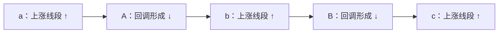
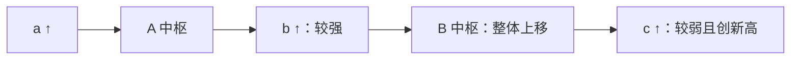
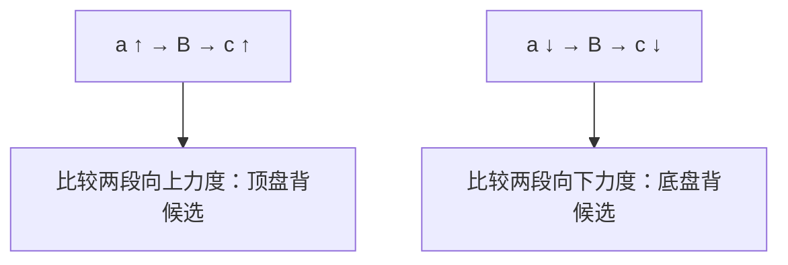

# 缠论背驰的线段化与有向中枢规则

版本：1.0 · 2026-09-27

## 1. 结论

可以把 `a+A+b+B+c`、`a+B+c` 简化为**线段与线段中枢的方向一致性模型**，但须区分两层结果：

1. **线段层候选背驰**：`a/b/c` 是同方向、已确认的线段；`A/B` 是由连续线段构成的同级别中枢；比较同向线段的力度。这是本文的工程模型。
2. **原文标准趋势背驰**：除线段层的形态外，还须核实该级别走势确为趋势、`A/B` 同级别且符合趋势中枢关系、`c` 达到次级别走势的结构要求并包含对 `B` 的第三类买卖点、向上时创新高或向下时创新低。只有一根单纯的线段并不自动满足这些条件。[第17、20、37课](https://eczsc.com/originals/37)。

以下 `↑/↓` 均指价格方向；图为结构示意，不表示价格距离或实际行情。

## 2. 对象和级别

- **笔**：按事先固定的笔规则划分。
- **线段**：按第67课的特征序列等规则划分，必须有起点、终点、方向和确认状态；未完成的当下线段只可参与候选判断。[第67课](https://eczsc.com/originals/67)。
- **线段中枢**：以连续三个已完成、相邻的线段在价格上的共同重叠区间起算。这里先固定“以线段为次级单位”的分析层，不在同一次比较里混用笔、线段和更高级别走势类型。原文中枢的严格表述是至少三个连续**次级别走势类型**的重叠；把线段作为次级单位，是工程建模选择，须单独标注，不能声称原文将所有线段都等同于次级别走势类型。[第17、18、67课](https://chanlun108.cn/chanzhongshuochan108ke/18.html)。
- **力度**：结构确认是主条件，MACD 是辅助。本文的 `strength(segment, dir)` 只比较同一时间序列、同一 MACD 参数、同一分析层、同向线段的对应柱面积；实际指标还需记录 DIF/DEA 的形态。[第24、25课](https://eczsc.com/originals/24)。

当前工程额外记录 `macd_extreme_relation` 作为辅助证据：上涨段比较 DIFF/DEA 各自最大值，后段严格较小记为减弱；下跌段比较各自最小值，后段严格较大记为减弱。两条线分别判定，结果为 `both_weaker`、`diff_only`、`dea_only`、`neither_weaker` 或 `unavailable`。相等不算减弱，缺任一完整序列即不可判。这是**极值关系的工程摘要，不等于完整曲线形态，也不独立触发或确认背驰**；面积衰减仍须与结构条件一同审查。

中枢区间 `Z=[ZD,ZG]`。当三段的高低分别为 `(h1,l1),(h2,l2),(h3,l3)`，最初区间为 `[max(l1,l2,l3), min(h1,h2,h3)]`，必须非空；延伸、扩展、重划需按原文规则重新判定，不能仅用固定的前三段区间无限延用。[第18、20课](https://eczsc.com/originals/20)。

在段级分解中，前一中枢的已确认离开段**允许同时充当后一中枢的第一构成段及进入段**。后一中枢仍须由这条段及紧接的两条已确认段形成正宽度的三段共同重叠；不得复用前一中枢的种子段，也不得因为它曾是离开段就免除新中枢的独立构成与确认条件。两中枢的共享段须在连接关系中显式记录，后续 `a/b/c` 比较不得把共享角色误作两条独立线段。此为本项目的连续分解规则，不改变笔级中枢规则。

## 3. 中枢有两种不同的“方向”

### 3.1 形成方向 `formation_dir`：第20课原文术语

一个中枢的前三段线段按时间通常呈 `↑↓↑` 或 `↓↑↓`：

| 三段 | 中枢形成方式 | `formation_dir` |
|---|---|---|
| `↑↓↑` | 回升形成 | `UP` |
| `↓↑↓` | 回调形成 | `DOWN` |

第20课将与中枢形成方向一致的内部次级别走势段记为 `Z_n`。这里的方向是**构造中枢的方向**，不是中枢向上/向下移动的方向。[第20课](https://eczsc.com/originals/20)。

### 3.2 相对移动方向 `relative_dir`：本文的工程字段

比较当前中枢 `B` 与同级别、同一分解序列中前一个中枢 `A`：

| 判定 | `relative_dir(B)` | 后续处理 |
|---|---|---|
| `B` 及其围绕波动严格处在 `A` 的上方，满足趋势中枢非重叠条件 | `UP` | 可继续审查上涨趋势结构 |
| `B` 及其围绕波动严格处在 `A` 的下方，满足趋势中枢非重叠条件 | `DOWN` | 可继续审查下跌趋势结构 |
| 核心区间或围绕波动相接、交叠，或级别重划 | `OVERLAP` | 检查中枢延伸/扩展/高级别中枢；不认定为标准趋势 |
| 无可比的前一同级别中枢，或前中枢尚未确认 | `UNKNOWN` | 不能从“否则”推成 `UP` |

严格趋势关系采用第20课围绕中枢的 `GG/DD` 等条件：后一个的 `DD >` 前一个的 `GG` 对应上涨；后一个的 `GG <` 前一个的 `DD` 对应下跌。**只看两个中枢的中心价或 `[ZD,ZG]` 不够**：核心区间看似错开而外围波动重叠时，原文可能将其归为更大级别中枢。[第20课](https://eczsc.com/originals/20)。

本项目将**完整主体范围**与**相邻比较范围**分开记录。完整主体 `dd_i64/gg_i64` 取构成段的最高／最低价；相邻比较 `comparison_dd_i64/comparison_gg_i64` 通常等于完整主体。仅在线段流中，若前一中枢的离开段兼任当前中枢第一构成段，则这条共享段仍参与三段交叠、`ZD/ZG` 和完整主体范围，但从当前中枢的相邻比较范围中排除；前一中枢如也有共享首段，比较时同样采用其已经排除首段的比较范围。笔流不作此排除。离开和首次回试不混入旧中枢主体，`observed_low/high` 仍记录完整观察范围。

**这项排除是用户选择的工程比较口径，不等同于宣称第20课原文要求排除构成段。**趋势候选须同时满足两中枢核心区间和上述比较范围严格分离；图上必须能查看被排除段 ID、完整主体与比较范围。即便相邻关系变为 `UP/DOWN`，仍须另验 `a+A+b+B+c`、MACD 力度、新极值及 `c` 的内部结构，不能直接升级为原文标准趋势背驰。截图对应的 AOL9 71,149 根、数据修订 `2904362e6217` 的只读对照中：完整计入时 62 组相邻段中枢全为 `OVERLAP`；19.1.0 实际逐 K 重算得到 63 个段中枢，相邻关系为 `UP` 8 组、`DOWN` 12 组、`OVERLAP` 42 组，首个中枢为 `UNKNOWN`。独立排除首段审计与实际结果逐项一致。这些是**中枢相对关系数量，不是背驰信号数量**。

比较范围只供相邻中枢迁移判断；解释三买/三卖的回试距“中枢外围”多远时，仍采用**完整主体 DD/GG**，不能把排除共享首段后的区间误当成中枢本体。

因此建议同时保存：

```text
Center {
  id, level, first_segment, last_segment, ZD, ZG,
  full_body_DD, full_body_GG, comparison_DD, comparison_GG,
  comparison_excluded_entry_id,
  formation_dir, relative_dir, prev_same_level_id,
  completed, decomposition_id
}
```

`relative_dir` 是当前中枢**相对于前一个中枢**的关系，附着在当前对象上方便程序访问；它不是中枢孤立存在时的固有方向。第一个中枢照样有 `formation_dir`，但 `relative_dir=UNKNOWN`。

### 图1：两种方向可以相反



若 `B` 整体严格高于 `A`，则 `relative_dir(B)=UP`；图中 `formation_dir(A)=formation_dir(B)=DOWN`。这**不矛盾**。下跌例子完全镜像：`a/b/c` 都是下跌线段，中枢由回升线段 `↑↓↑` 形成，`relative_dir(B)=DOWN`。[第17、20、37课](https://eczsc.com/originals/37)。

## 4. 同方向线段约束

对本文的**简化模型**，固定目标方向 `dir∈{UP,DOWN}`：

```text
trend pattern:  a(dir) + A + b(dir) + B + c(dir)
range pattern:  a(dir) + B + c(dir)
```

`A/B` 内部当然包含双向交替线段，不要求中枢内部也只沿 `dir` 运动。对趋势模型，`dir` 还须与 `relative_dir(B)` 一致。对盘整模型，`B` 可以是本次走势的**第一个中枢**，此时 `relative_dir(B)=UNKNOWN`，不能因为没有前中枢就剔除盘整背驰。

| 比较 | 条件 | 候选结果 |
|---|---|---|
| `b↑` 对 `c↑`，或 `a↑` 对 `c↑` | 后一段向上力度较弱 | 顶背驰候选 |
| `b↓` 对 `c↓`，或 `a↓` 对 `c↓` | 后一段向下力度较弱 | 底背驰候选 |
| 一段向上、一段向下 | 不适用同向指标面积比 | 另列中枢反向力度分析，不计入本模型 |

第33课还有从同一中枢比较**相反方向离开力度**的释义。这与本文的同向线段简化模型并行，不能说第33课禁止反向力度比较；也不能把反向红柱/绿柱直接套同向面积规则。[第33课](https://eczsc.com/originals/33)。

## 5. 两类背驰规则

> 20.0.0 口径更新：下文保留的“MACD 面积收缩”和“`c_span < b_span/a_span` 为硬门槛”描述的是 19.3.2 legacy 规则，不再是当前正式算法。当前线段比较先验证同向、连续性、中心关系、趋势新极值及因果完成；主力度取结构端点方向位移 `D` 与原始观测 K 间隔 `N` 的速度 `D/N`。`D_c <= D_ref` 且 `D_c/N_c <= D_ref/N_ref`、至少一项严格小于时成立；或者按下文所列同向中枢基准计算的价格跨度满足 `5*R_c < 4*R_ref` 时覆盖力度冲突。两种触发都要求完整且正值的可比运动窗口，等于 80% 不触发。MACD 面积与 DIFF/DEA 极值仅作诊断，不能否决主力度；上述公式是项目工程选择，不宣称是 108 课唯一公式。中枢内震荡没有外部中枢基准，仅用 `D/N` 比较。趋势标准升级仍须 `c` 内两个已确认笔中枢及笔级三类点的工程证明。

### 5.1 标准趋势背驰 `a+A+b+B+c`

**第一层：线段层候选。**

1. `a,b,c` 依时间顺序为同向线段，`a/b` 与 `A/B` 已确认、边界连续且归属唯一；进行当下监测时 `c` 可尚未完成，此时只输出 `PROVISIONAL`，完成后才审查最终确认。
   线段化工程模型还要求三条外部段的**起点价格**沿目标方向严格推进：上涨为 `start(a)<start(b)<start(c)`，下跌为 `start(a)>start(b)>start(c)`。相等不通过。中枢严格上移／下移和 `c` 的终点创新极值都不能代替这一检查；否则深回撤可让 `b` 从 `a` 起点反方向重新出发，却被误连成同一有向趋势。
2. `A/B` 同级别，`relative_dir(B)=dir`，且核心和围绕波动通过严格趋势检查；不是一个高级别中枢的震荡。[第20、37课](https://eczsc.com/originals/37)。
3. `strength(c,dir) < strength(b,dir)`。若使用工程阈值 `ratio = strength(c)/strength(b) < 1−ε`，`ε` 必须作为配置记录；“明显小于”及具体阈值**不是108课给出的统一常数**。强度为0、样本不完整或不同周期时标记不可比。
   从 19.3.2 起另设用户选择的保守**换中枢基准价格幅度门槛**：上涨计算 `b_span = high(b)−A.ZD`、`c_span = high(c)−B.ZD`；下跌计算 `b_span = A.ZG−low(b)`、`c_span = B.ZG−low(c)`。两者须为正且 `c_span < b_span`；相等不算收缩。这里的 high/low 是该线段实际区间极值，不移动 K 线或重算 MACD。形成态 `c` 也按当前已见极值逐 K 检查。此门槛是工程过滤，不宣称为第24课原文公式。

**第二层：原文标准确认。**

4. `c` 在原文所用级别达到次级别走势结构，包含对 `B` 的第三类买卖点；第 37 课进一步明确，`c` 至少包含**两个次级别中枢**，否则不足以完成次级别离开与回拉的结构。若仅是一根线段且没有可证实的内部结构，或虽可在其中看到一次笔级回试但不能证明两个完整次级别中枢，输出 `SEGMENT_TREND_DIVERGENCE_CANDIDATE`，不输出 `STANDARD_TREND_DIVERGENCE`。[第37课](https://chanlun108.cn/chanzhongshuochan108ke/37.html)。

**项目工程映射 `bi_two_confirmed_centers_type3_v1`（19.3.0 起）**：只对完成态 `c`，读取同一因果时点的已确认笔流及 `CLOSED` 笔中枢；至少两个不同且有序的笔中枢主体须完整落在 `c` 内，并在信号确认时刻前已确认。`c` 内第一条从 `B.ZG` 向上穿越（向下镜像为穿越 `B.ZD`）的已确认笔作为离开笔，紧接的首条反向笔须以全笔最低价不低于 `ZG`（向下镜像为全笔最高价不高于 `ZD`）守界，才算本工程的 `B` 笔级三类点证明，等于边界允许。若首次回试失败，不得挑后来的成功回试顶替。只有两个布尔证据均为真，加上第一层的严格趋势、新极值、当前版本主力度和后续反向段确认，才将候选升级为本工程的 `standard_trend` 并派生标准一买卖点。笔中枢是用户指定的**次级别工程映射**，不声称与原文所有次级别走势类型天然等价；界面须展示映射名、笔中枢及离开／回试对象 ID、证据确认 K。未提供笔流时两个布尔量保持 `null`；已核验而条件不满足则为 `false`。同级线段三类点和只有一个笔中枢都不能补足该证据。形成态 `c` 一律不升级。
5. `dir=UP` 时 `c` 创该上涨趋势新高；`dir=DOWN` 时 `c` 创新低。未创新高/低者按中枢震荡、盘整背驰或二类点的相应规则分析，不贴标准趋势背驰标签。[第37课](https://eczsc.com/originals/37)。
6. 对已经确认的 `c` 才给出最终结论。运行中的 `c` 只标 `PROVISIONAL`；其继续伸长、力度超过 `b` 时撤销候选。[第43、61课](https://eczsc.com/originals/61)。

### 图2：标准上涨结构与较弱的 `c`



图2展示**外部比较**；`c` 内部的次级别结构和三买仍须单独验证，图中没有省略其要求。下跌时将箭头和相对位置反过来。

### 5.2 盘整背驰 `a+B+c`

1. 本次**已完成的目标级别走势**仅有一个本级中枢 `B`。若 `B` 尚未完成，只能保持候选；若第二个非重叠同级别中枢出现，应重新按趋势关系分解。[第17、27课](https://eczsc.com/originals/27)。
2. `a` 与 `c` 是同向、可比的线段；`strength(c,dir) < strength(a,dir)`，阈值规则同上。当前线段模型要求 `a` 紧邻中枢第一构成段之前；若紧邻段反向，不得再向左跳过它拼出未经证明的 `a+B+c`。这项连续性限制是当前对象图的保守工程约束；将来只有在额外的完整走势类型对象证明中间段归属后，才可另行放宽。外部 `c` 必须在中枢主体构成段之后；若第三构成段兼任离开段，它仍属中枢内部，不能重复充当外部 `c`。另可在一个中枢内部比较同向的 `A_i` 与 `A_{i+2}`，但要记录它们属于**中枢震荡段比较**，不要强行重命名为外部 `a/c`。[第24、39、53课](https://eczsc.com/originals/39)。
   外部盘整背驰同样加换基准幅度门槛：上涨取 `a_span = high(a)−start(a)`、`c_span = high(c)−B.ZD`，下跌取 `a_span = start(a)−low(a)`、`c_span = B.ZG−low(c)`；须 `0 < c_span < a_span`。`a` 前无本次可比中枢，故沿用它的真实起点；这不是把原始 MACD 柱面积平移到中枢底部，也不适用于中枢内部震荡背驰。盘整背驰若经此门槛消失，由它派生的类一／类二点也不再生成。
3. `c` 上/下未越过第一段极值仍可按盘整背驰的相应情形分析。若向上突破 `B` 后出现顶盘背，后续回试可能进中枢，也可能不进而形成三买；向下对称。**盘背不是趋势背驰，也不能仅凭衰减断定跌回中枢**。[第24、27课](https://eczsc.com/originals/24)。
4. `relative_dir(B)` 仅是上下文过滤器：`UP` 可让策略优先监测向上离开，`DOWN` 可优先监测向下离开；`UNKNOWN` 允许双向候选。它不是原文盘整背驰成立的必要条件。若策略要求“只做与中枢移动方向同向的盘背”，应额外命名为 `DIRECTION_FILTERED_RANGE_DIVERGENCE`。

### 图3：一个中枢、两种候选方向



## 6. 状态机与输出字段

```text
Candidate(type, dir, level, a_id, b_id?, A_id?, B_id,
          formation_dir_B, relative_dir_B,
          left_strength, right_strength, ratio,
          c_new_extreme, c_contains_type3, c_meets_sublevel,
          status, evidence, invalidation_reason)

status = FORMING | STRUCTURE_CANDIDATE | CONFIRMED | INVALIDATED
type   = TREND | RANGE | DIRECTION_FILTERED_RANGE
```

界面选中线段趋势候选时，应将可见的 `a`、用于力度比较的 `b` 和当前 `c` 分色高亮，定位范围容纳这三段及确认点；盘整背驰只强调实际比较的 `a/c`。若证据跨度超过单次 K 线加载上限，保留有限范围定位并明示未加载部分，不能画出并不存在的线段。

工程实现中 `status=forming` 只用已确认线段/中枢作为参照，把扫描器的未确认候选离开段从起点延伸至**当前已见 K 线**，按已见范围暂算极值及 MACD 面积；对象的价格为期间方向极值，时间锚点为本次观察 K 线。它不参与三段中枢构造，也不派生标准一买卖点。每根新 K 线可修订该证据；若力度不再减弱、创新极值条件失效或结构改划，以当时 K 线发布 `invalidated`，不能删除已经发生的观察历史。候选线段得到后继结构确认后，才转入已完成线段的 `candidate/confirmed` 判定。

建议执行顺序：

```text
固定分解规则与级别 → 确认线段 → 构造中枢及 formation_dir
→ 与前中枢比较得到 relative_dir（可能 UNKNOWN/OVERLAP）
→ 根据当前 c 的方向选择同向前段
→ 检查结构、力度、创新高/低和内部三买/三卖
→ 输出候选或确认；当分解改变时撤销并重算
```

### 最小反例检查

| 输入 | 期望 |
|---|---|
| 只有一个中枢，`a↑/c↑`，无前同级中枢 | 可以判断向上盘背候选；`relative_dir=UNKNOWN`。 |
| `A/B` 核心价区不交叠，但外围波动交叠 | 不直接确认为上涨/下跌趋势；检查更大级别中枢。 |
| `A/B` 同级且严格上移，`b↑/c↑`，但 `c` 未创新高 | 不输出标准趋势顶背驰。 |
| `c` 仅一根向上线段，未能证明包含 `B` 的三买 | 可输出线段候选，不输出原文标准趋势背驰。 |
| `a↑/c↓` | 不计算同向盘背比值；可另做第33课中枢反向力度分析。 |
| 前一个中枢缺失、重叠或被重划 | `relative_dir` 不得默认 `UP`，重算依赖结果。 |

## 7. 与原文的对应和边界

| 课次 | 本文件采用的要点 |
|---|---|
| [17](https://chanlun108.cn/chanzhongshuochan108ke/17.html)、[18](https://chanlun108.cn/chanzhongshuochan108ke/18.html) | 中枢、盘整、趋势、次级别重叠的定义。 |
| [20](https://eczsc.com/originals/20) | 中枢形成方向、`Z_n`、`ZD/ZG`、严格的前后中枢关系及三买/三卖。 |
| [24](https://eczsc.com/originals/24)、[27](https://eczsc.com/originals/27) | 同向力度的 MACD 辅助、趋势背驰与盘整背驰的不同后果。 |
| [33](https://eczsc.com/originals/33)、[37](https://eczsc.com/originals/37) | 中枢反向离开力度的另一释义；标准趋势背驰对 `c` 的结构和新极值约束。 |
| [39](https://eczsc.com/originals/39)、[53](https://eczsc.com/originals/53) | 同级分解的 `A_i/A_{i+2}` 盘整力度比较与盘背的推广性质。 |
| [43](https://eczsc.com/originals/43)、[67](https://eczsc.com/originals/67)、[70](https://eczsc.com/originals/70) | 候选背驰可被走势延伸否定、线段划分、图解中的比较段选择。 |

**实施原则：**可以把 `a/b/c` 同向线段化，用它筛查背驰；必须把 `formation_dir` 与 `relative_dir` 分列，并保留 `UNKNOWN/OVERLAP`。若要输出“标准趋势背驰”，还要完成第37课的内部结构核验。这个分层使简化模型既能运行，也不会把线段形似误报为原文严格结论。
